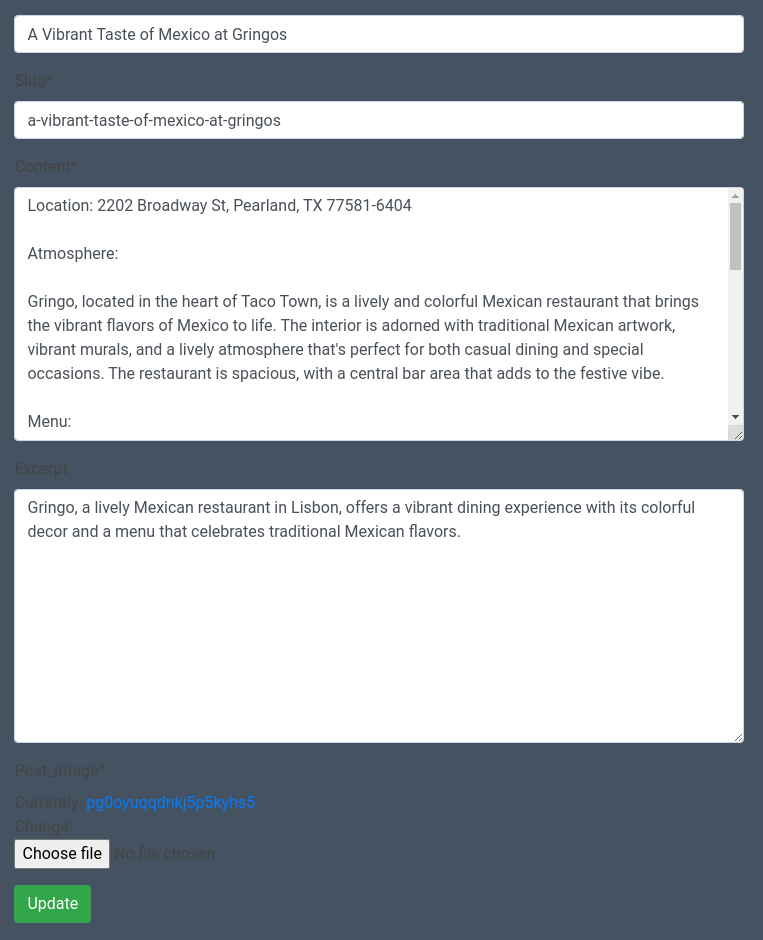
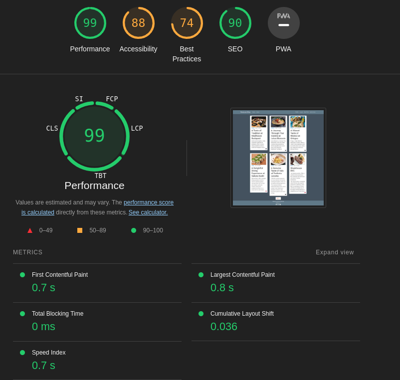
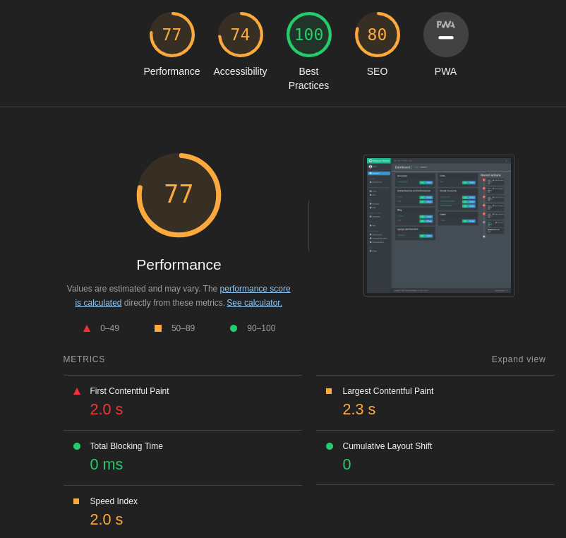
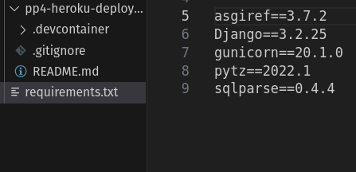
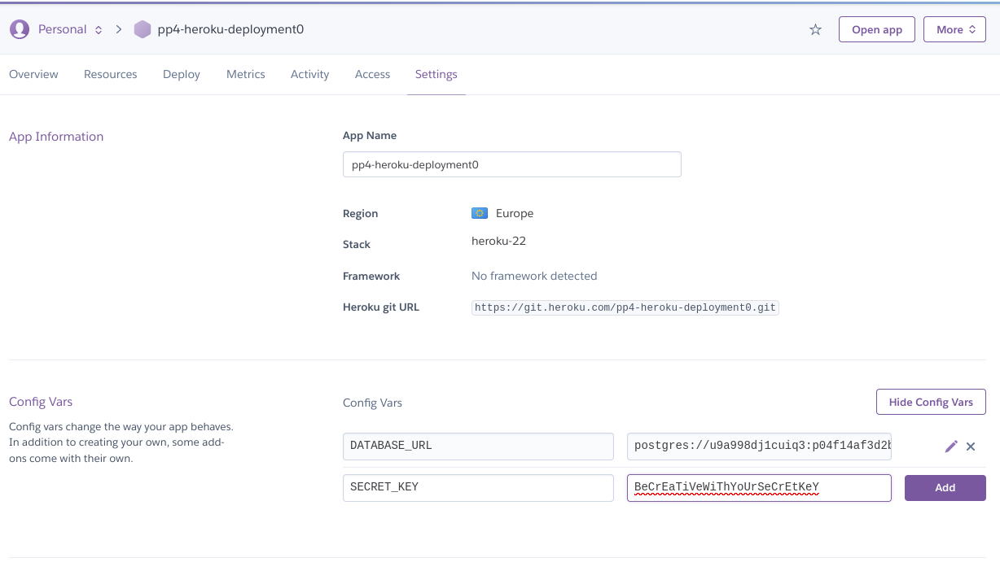
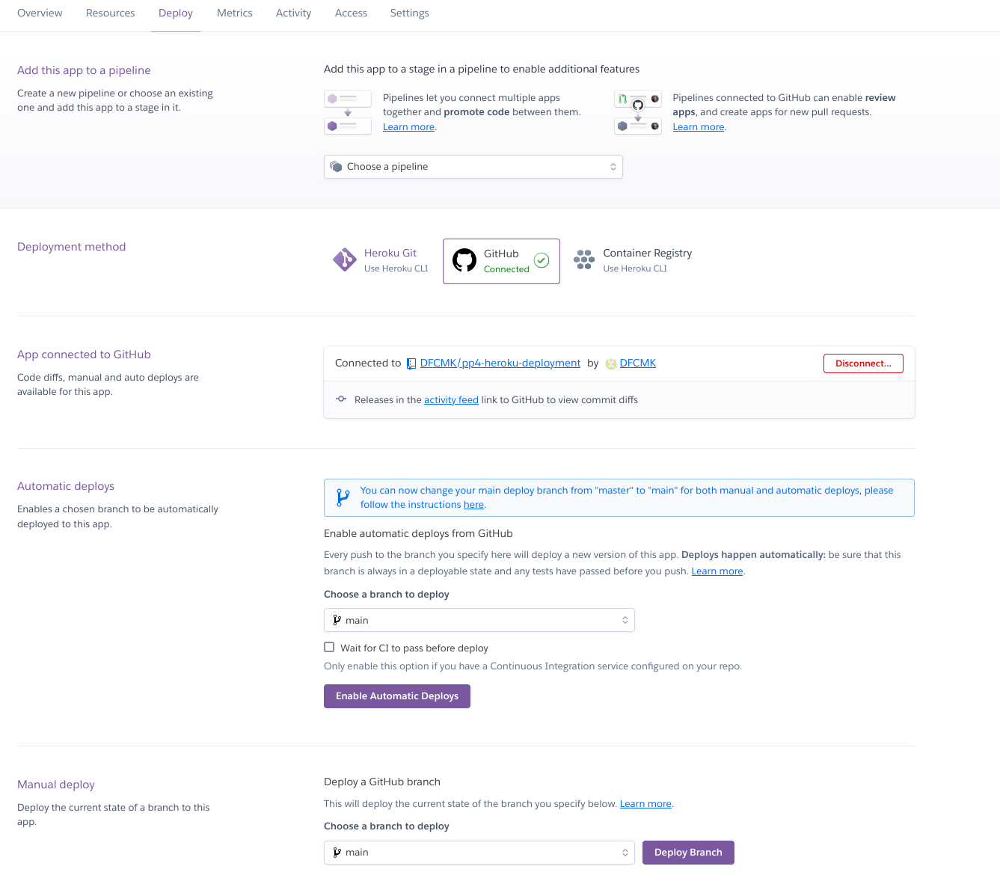

# **Restaurant-Review-Blog**
Restaurant-Review-Blog is designed with a singular purpose: to enable users to share their unique dining adventures and insights with a global audience. Here, users can meticulously document their restaurant visits, capturing the essence of every dining experience, from the exquisite flavors to the ambiance that makes each visit memorable.

Users can leave comments, share their reviews, and express their opinions through simple thumbs-up or thumbs-down gestures. This interactive environment encourages a rich exchange of ideas and perspectives, making every visit to Restaurant-Review-Blog a unique culinary adventure.

But the journey doesn't end there! Users have the option to mark their favorite posts, ensuring that unforgettable dining experiences are always within easy reach. This feature is a testament to our commitment to enhancing the user experience and making the most cherished dining memories easily accessible.

This fictional site was created for Portfolio Project #4 (Full-Stack Toolkit) - Diploma in Full Stack Software Development Diploma at the [Code Institute](https://www.codeinstitute.net).

[View live website here](https://django-restaurant-blog-d6ddec41b70e.herokuapp.com/)


# Table of Content

* [**Project**](<#project>)
    * [Objective](<#objective>)
    * [Site Users Goal](<#site-users-goal>)
    * [Site Owners Goal](<#site-owners-goal>)
    * [Project Management](<#project-management>)

* [**User Experience (UX)**](<#user-experience-ux>)
    * [User Stories](<#user-stories>)
    * [Site Structure](<#site-structure>)
    * [Design Choices](<#design-choices>)

* [**Existing Features**](<#existing-features>)
    * [Navigation](<#navigation>)
    * [about](<#about>)
    * [Home](<#home>)
    * [Profile](<#profile>)
    * [Create Post](<#create-post>)
    * [Post](<#post>)
    * [Update Post / Delete Post](<#update-post-and-delete-post>)
    * [Thumbs / Favorites](<#thumbs-and-favorites>)
    * [Create / Update / Delete Comment](<#create-update-and-delete-comment>)
    * [Admin Area](<#admin-area>)
    * [Sign Up](<#sign-up>)
    * [Sign In](<#sign-in>)
    * [Sign Out](<#sign-out>)
    * [Footer](<#footer>)
    * [Flash Messages](<#flash-messages-and-confirmation-pages-to-the-user>)

* [**Features Left To Implement**](<#features-left-to-implement>)

* [**Technologies Used**](<#technologies-used>)
    * [Languages](<#languages>)
    * [Frameworks & Software](<#frameworks--software>)
    * [Libraries](<#libraries>)

* [**Testing**](<#testing>)
    * [Testing User Stories](<#testing-user-stories>)
    * [Testing User Stories](<#testing-admin-stories>)
    * [Code Validation](<#code-validation>)
    * [Additional Testing](<#additional-testing>)
    * [Known Bugs](<#known-bugs>)
* [Deployment](<#deployment>)
* [Credits](<#credits>)
* [Acknowledgements](<#acknowledgements>)

# **Project**

## Objective
I decided to build a Restaurant Review Page because there are many examples of it, such as Yelp and others, which are very useful for making informed decisions and avoiding unpleasant surprises. A review platform comes in handy when you are visiting from somewhere and need a reliable source to filter out the restaurants worth dining in.

## Site Users Goal
The user want to be able to write and Publish Posts to Share experiences about Restaurants and leave a comment below other users Posts.

## Site Owners Goal
The goal of the site owner is to deliver a site where the users in an intuitive part of the Website and be able to interact with the community.

## Project Management


### Github Board
I've been using Github Projects to plan and organize the user stories for this Project

<details><summary><b>Github Board</b></summary>

<!--Screenshots about user stories on Github HERE!!-->
</details><br/>

[Back to top](<#table-of-content>)

# **User Experience (UX)**

## User Stories
Below the user stories for the project are listed to clarify why particular feature matters. These will then be tested and confirmed in the [Testing](<#testing>) section.

### Site User
|  | | | 
|:-------:|:--------|:--------|
| As a Site User | I can view a list of **Restaurant** reviews so that I can select one to read | &check; |
| As a Site User | I can click on a specific review to read it in detail | &check; |
| As a Site User | I can like and unlike a review to interact with it | &check; |
| As a Site User | I can view the number of likes on each review to see its popularity | &check; |
| As a Site User | I can contact The Restaurant Review easily | &check; |
| As a Site User | I can navigate easily through paginated lists of posts | &check; |
| As a Site User | I can view comments on a specific review to read conversations | &check; |
| As a Site User | I can sign up for an account to like and comment on reviews, create a profile page, create my own reviews, and edit/remove my reviews | &check; |
| As a Site User | I can create a profile page for other reviewers to read about me | &check; |
| As a Site User | I can comment on a review to join the conversation | &check; |
| As a Site User | I can edit my comment to change its content if needed | &check; |
| As a Site User | I can remove my review to have full control over my reviews | &check; |
| As a Site User | I can create a new review to contribute new content | &check; |
| As a Site User | I can log out from the site to ensure the security of my information | &check; |
| As a Site User | I can receive visual feedback when interacting with the content | &check; |

### Site Admin

|  | | | 
|:-------:|:--------|:--------|
| As a Site Admin | I can log out from the site so that I can feel safe that nobody can access my information | &check; |
| As a Site Admin | I can create, read, update and delete reviews so that I can manage my review content | &check; |
| As a Site Admin | I can approve and disapprove comments so that I can secure a safe environment for the Site Users | &check; |
| As a Site Admin | I can access an admin area so that I can manage the site's permissions and content | &check; |
| As a Site Admin | I can get visual feedback when interacting with the content so that I can be sure how I have interacted with the page | &check; |
| As a Site Admin | I want to use Jazzmin instead of Django's default Admin page to have a more user-friendly and visually appealing interface | &check; |

[Back to top](<#table-of-content>)

## Site Structure

The Restaurant Review Blog is organized into two distinct sections based on the user's **login** status: **Logged Out** and **Logged In**. The availability of pages varies depending on whether the user is logged in or not. For users who are **not logged in**, the navigation bar at the top of the site displays the following pages: **Home, About, Login**, and **Register**. Conversely, when a user is **logged in**, the navigation bar includes **Home, About, Profile, Logout**, and **New Post**. Additionally, if the user is logged in as an **administrator**, an **Admin** page is also accessible, along with the other pages mentioned. The design of the site is minimalistic, clean, and intuitive, ensuring ease of navigation for users.

Read more about the different choices in the [Features](<#features>) section.

[Back to top](<#table-of-content>)

## Design Choices

* ### Color Scheme
The color scheme for the Restaurant Review site is designed with a focus on a dark background, inspired by Bootstrap's dark theme.
The Navbar and Footer are styled with a light grey background color, specifically using the hexadecimal color code #555. This choice ensures a subtle contrast that maintains readability and aesthetic appeal.

The main body of the site utilizes Bootstrap's dark-bg class, which is designed to provide a dark background suitable for text and other elements. This class is essential for creating a visually appealing and readable layout, especially in environments with bright lighting conditions.

For the Published Posts, a white card container is employed to encapsulate the content. This container is styled with a black text color, which contrasts well with the white background, enhancing readability and ensuring that the content stands out against the darker background of the site. This combination of colors ensures that the text is easily readable, making it simple for users to navigate through the site and find the information they're looking for.

The Colors choosen for this project are based on the <a href="https://www.colorhexa.com/5f788a">Monochromatic Colorsheme:</a> 


* ### Typography
The typography for the Restaurant Review site is designed with a focus on readability and aesthetic appeal. The primary font chosen is 'Roboto', which is used throughout the site to ensure a consistent and modern look. For the headings, 'Roboto' is utilized in its regular weight to create a strong visual hierarchy and draw attention to the main points of each section.

For the body text, including excerpts and post content, the 'Roboto' font is used in its regular weight. This choice ensures that the text remains readable and maintains a cohesive look across the site. The fallback font for both 'Roboto' and the normal text is set to sans-serif, ensuring that the site's typography remains accessible and visually appealing even if the primary font fails to load for any reason.


[Back to top](<#table-of-content>)

# **Features**
The features of the site are listed below.

## **Existing Features**

### **Navigation**
The navigation bar of the Restaurant Review site is designed to be clean and straightforward, ensuring ease of use for all visitors. The availability of different pages to the user depends on their login status. Specifically, if a user is logged in, additional pages become accessible to them. Furthermore, an extra page is made visible to users who are logged in as administrators, providing them with additional functionalities and controls.

*Links that are visible to logged out users*

* Home - Displays posts as a list of 6 per page. On devices with a large screen, such as laptops or PCs, 3 posts are displayed per row within a white card container to maintain readability. If there are fewer than 7 posts, a "Next" button will not appear. However, if there are more than 7 posts, a "Next" button will appear, allowing users to visit the second page.
* About -  Describes the purpose and motivation behind the Restaurant Review Blog.
* Login - Contains a login form where users can enter their username and password to log into their account.
* Register - Contains a sign-up form where users can enter their username, email address, password, and password confirmation to create a new account.

<details><summary><b>Navigation Large - User Not Logged In</b></summary>


</details><br/>


*Links that are visible to logged in users*

All of the links that are visible to a not logged in user plus the ones below.

* Profile - User can visit his profile and edit or delete his Profile. He can edit his profile image, user details such as Name, emailadress etc. The Users Profile page displays also the users own posts in a similar way like on the homepage and the Posts he marked as Favorites below that in the same way like on the homepage within a scrollable container.
* Logout - Log user out of his profile and show a brief logged out message to user.
* New Post - User can Create a new Post and upload an Image to it.

<details><summary><b>Navigation Large - User Logged In</b></summary>


</details><br/>

<details><summary><b>Navigation Small - User Logged In</b></summary>


</details><br/>

*Link that is visible if user is administrator*

All of the links above plus the one below.
* Admin Area - Bring the Administrator to the Django Admin page, where they can view and modify all users, their permissions, posts, comments, approve comments and posts, add or remove permissions for certain users, etc. The default Django Admin page has been replaced with Jazzmin, as it provides a better overview and has been configured to include a "Back To Website" link in the top left corner of the page. This allows the user to return to the website at any time.

<details><summary><b>Additional Link in Navbar - Admin Logged In</b></summary>


</details><br/>

### **About**
The About Page describes the purpose and motivation behind the website to the user.

<details><summary><b>About page</b></summary>


</details><br/>

### **Home**
The Home Page contains a list of all published posts and displays 3 posts per row. The Posts are wrapped in a white card container with an Image and the Title and Excerpt below that. All Posts displayed on the Homepage are wrapped in a scrollable container to give some flexibility to it when the content given to it makes the post-container grow. In the bottom right corner of the post container, there are 3 icons: a thumbs up, a thumbs down, and a heart icon. The user can up and down vote the Post using the thumbs and save the post to their Favorites by clicking on the Heart icon. If the Heart Icon is pressed, the icon gets filled out with a red color, and the Favorites are saved to the user's Profile Page

<details><summary><b>Home Page</b></summary>


</details><br/>

### **Profile**
The User's Profile Page has a Profile container with the username, profile image, and user details such as email address, etc. Below that container, there are two buttons located at the bottom right side. One is the **Edit** button, and the other one is the **Delete** button. When the user clicks on Edit, the profile form opens up, allowing the user to adjust user details and profile image and save the changes with the save button below the form. When the user clicks on the 'Delete' button, a Modal will open up to get a second confirmation from the user to ensure users really want to delete theire profile. Below the Profile Container, the user's own published posts are listed in the same way they are on the homepage. Below that, there is a second section where the user's favorite posts are listed, also in the same way the homepage does. This layout ensures that the user always has his own and his favorite posts close by.


<details><summary><b>Profile Container</b></summary>


</details><br/>

<details><summary><b>Profile Form</b></summary>


</details><br/>

<details><summary><b>Deletion Modal</b></summary>


</details><br/>

<details><summary><b>Users Own Posts</b></summary>


</details><br/>

<details><summary><b>Users Favorite Posts</b></summary>


</details><br/>

### **Create Post**
If the user is logged in, they can create a post by clicking on the navbar link "New Post". This link directs the user to the post form where they must click on the button *Create Post* to confirm their decision and open the post form. The post form contains four input fields: Title, Slug, Content, and Excerpt.
The Slug field will be automatically populated based on the title.
Additionally, there is an upload field that allows the user to upload an image to their post.

**Important Notice:**: The Slug field only accepts letters and spaces, which will be replaced by a hyphen. Unfortunately, I haven't yet figured out how to allow special characters in the slug, so users need to choose titles that only contain normal letters and spaces in order to successfully save and publish the post.

<details><summary><b>Closed Post Form</b></summary>


</details><br/>

<details><summary><b>Opened Post Form</b></summary>


</details><br/>

### **Post**
When a user clicks on the title of a post on the homepage, they are redirected to the post page. The post page contains the title on the top left and the image on the top right. Below the title and image, the post content is displayed. Beneath the content, there are icons for thumbs up, thumbs down, and a heart icon on the bottom left side. Below these icons, there is a comment section with two containers. On the left side, approved comments are displayed, while on the right side, there is a small text input form with a submit button where logged-in users can write and post comments about the post. If a user is logged out, the right create-comment section will display a message: "You have to be logged in to leave a comment".
Post and comment sections are wrapped in a scrollable container to enable scrolling down to the end when the content overflows the regular body section.

* *Post* - Title with an image at the top of the page, followed by content below.
* *Icons Thumbs (Up/Down), Heart* - Icons allow user to like/dislike and mark post as favorite
<!--IMPLEMENTATION OF DRAFT AND APPROVAL FOR POSTS WOULD BE NECESSERY!!!!!-->

<details><summary><b>Post</b></summary>


</details><br/>

### **Update Post / Delete Post**
Below the user's own published posts, there are two buttons: Edit and Delete. When a user clicks on the Edit button, the post form will open up and repopulate the input fields with the existing post content and title. Additionally, there is an upload field below the post form that allows the user to upload a new image to the post. After making any necessary changes, the user can click the Update button below the form to submit the new data. If the user wishes to delete the post, they can click the Delete button.
<!--ADD APPROVE FUNCTIONALITY SO SUBMITED POSTS GET SAVED AS DRAFT AS DEFAULT!!!!!!-->

<details><summary><b>Post with Update option</b></summary>


</details><br/>

<details><summary><b>Post Update Form</b></summary>


</details><br/>

### Thumbs / Favorites

Users can interact with the thumbs-up and thumbs-down icons to indicate whether they like or dislike a post. Clicking once on one of the thumb icons will increase the count by one. If the user clicks on the opposite thumb icon from the one clicked before, the old icon's count will reset to -1, and the recently clicked icon will increase by 1.

Additionally, users can click on the Heart icon to save the post to their favorites. The post will then be displayed within the user's profile page, and the Heart icon will be filled out in red to indicate that it has been saved to favorites.

<details><summary><b>Post Icons</b></summary>


</details><br/>

### **Create / Update / Delete Comment**
If the user is logged in, they can write and submit comments below the posts. Once submitted, comments will need to be approved by an administrator to ensure they comply with the site's policy and terms. If a user wishes to update their comment, they can simply click the Edit button below their own comment. Clicking the Edit button in the comment section on the left side will automatically repopulate the text field of the create-comment container on the right side with the comment's content. Additionally, with the dynamic help of the innerText function in JavaScript, the Submit button will become an Update button.
The second button that appears below the user's own comments is the Delete button. Clicking on the Delete button will open a modal to get a second confirmation from the user to ensure they are sure about deleting their comment.

<details><summary><b>Create Comment</b></summary>


</details><br/>

<details><summary><b>Comment Buttons</b></summary>


</details><br/>

<details><summary><b>Update Comment</b></summary>


</details><br/>

<details><summary><b>Delete Comment Modal</b></summary>


</details><br/>

<details><summary><b>Comment and Create Container</b></summary>


</details><br/>


### **Admin Area**
On this page, the administrator (or another superuser designated by Restaurant Review) is responsible for content management, including approving comments, managing user rights, profiles, posts, etc. The Admin link in the Navbar of the Restaurant Review Blog directs superusers to the default Django Admin page, which has been replaced with Jazzmin to provide a better overview. Jazzmin is configured to use Dark mode instead of Light mode, and a Back To Website button has been added to the Top menu, which is only visible on larger devices like laptops, desktops, and tablets. 

**Important Notice** It is recommended to manage the site via the Admin page using devices with larger screens such as laptops, desktops, and tablets. This is because the "Back To Website" link in the Top Menu, which brings the superuser back to the website, is only displayed on these devices. If an administrator wants to manage the site's content via a smartphone, for instance, they will need to delete the /admin part of the URL to return to the website.

<details><summary><b>Navigation Large - Admin Logged In</b></summary>


</details><br/>

<details><summary><b>Navigation Small - Admin Logged In</b></summary>


</details><br/>

### **Register**
If a site visitor is not registered as a user at Restaurant Review, they can sign up. During the sign-up process, they can also upload a profile image. If they do not upload an image, the default image of Nobody will be set as their profile image. An unregistered user can only read and view the posts listed on the website but cannot leave comments or publish posts.

<details><summary><b>Register</b></summary>


</details><br/>

### **Login**
This is the sign-in form for users to access their accounts.

<details><summary><b>Sign In</b></summary>


</details><br/>

### **Logout**
When the user clicks "Logout" in the navbar, a brief message will be shown to them to inform them that they have successfully logged out from their accounts. Below that, there is a small "Login Again" link to allow the user to access the login form again.

<details><summary><b>Logout</b></summary>


</details><br/>

### **Footer**
The footer area includes the name of the person who made the website and social media links that users can use to follow *Restaurant Review*.

<details><summary><b>Footer</b></summary>


</details><br/>

### **Flash Messages and confirmation pages to the user**
The sites incorporates flash messages and confirmation messages when an action has been performed (i.e. delete/update actions). Examples of this in the screenshots below.

<details><summary><b>Confirmation Messages</b></summary>


</details><br/>

### Features Left to Implement

* Add more automated testing
* Add 'current page is active' in navbar
* Advanced Search: Implement advanced search functionality to allow users to search for restaurants based on various criteria such as cuisine, location, price range, etc.
* Rating system, which allow users to rate Published Reviews 1 to 5 Stars
* Recommendation System: Develop a recommendation system that suggests restaurants to users based on their past preferences and review

[Back to top](<#table-of-content>)

# Technologies Used

## Languages

* [Python](https://en.wikipedia.org/wiki/Python_(programming_language)) - Provides the functionality for the site.
* [HTML5](https://en.wikipedia.org/wiki/HTML) - Provides the content and structure for the website.
* [CSS3](https://en.wikipedia.org/wiki/CSS) - Provides the styling for the website.
* [JavaScript](https://en.wikipedia.org/wiki/JavaScript) - Provides interactive elements of the website

## Frameworks & Software
* [Bootstrap](https://getbootstrap.com/) - A CSS framework that helps building solid, responsive, mobile-first sites
* [Django](https://www.djangoproject.com/) - A model-view-template framework used to create the Review | Alliance site
* [Github](https://github.com/) - Used to host and edit the website.
* [Heroku](https://en.wikipedia.org/wiki/Heroku) - A cloud platform that the application is deployed to.
* [Lighthouse](https://developer.chrome.com/docs/lighthouse/overview/) - Used to test performance of site.
* [Responsive Design Checker](https://www.responsivedesignchecker.com/) - Used for responsiveness check.
* [Favicon](https://favicon.io/) - Used to create the favicon.
* [VSCode](https://code.visualstudio.com/) - Used to create and edit the site.
* [Google Chrome DevTools](https://developer.chrome.com/docs/devtools/) - Used to debug and test responsiveness.
* [Cloudinary](https://cloudinary.com/) - A service that hosts all static files in the project.
* [HTML Validation](https://validator.w3.org/) - Used to validate HTML code
* [CSS Validation](https://jigsaw.w3.org/css-validator/) - Used to validate CSS code
* [PEP8 Validation](http://pep8online.com/) - At the time for deploying this project the PEP8 Online Validaton service was offline, therefore not used.
* [JSHint Validation](https://jshint.com/) - Used to validate JavaScript code

## Libraries

[Back to top](<#table-of-content>)

The libraries used in this project are located in the requirements.txt file and have been documented below

* [asgiref](https://pypi.org/project/asgiref/) - ASGI is a standard for Python asynchronous web apps and servers to communicate with each other, and positioned as an asynchronous successor to WSGI.
* [cloudinary](https://pypi.org/project/cloudinary/) - The Cloudinary Python SDK allows you to quickly and easily integrate your application with Cloudinary. Effortlessly optimize, transform, upload and manage your cloud's assets.
* [dj3-cloudinary-storage](https://pypi.org/project/dj3-cloudinary-storage/) - Django Cloudinary Storage is a Django package that facilitates integration with Cloudinary by implementing Django Storage API.
* [Django](https://pypi.org/project/Django/) - Django is a high-level Python web framework that encourages rapid development and clean, pragmatic design.
* [django-allauth](https://pypi.org/project/django-allauth/) - Integrated set of Django applications addressing authentication, registration, account management as well as 3rd party (social) account authentication.
* [django-crispy-forms](https://pypi.org/project/django-crispy-forms/) - Used to integrate Django DRY forms in the project.
* [gunicorn](https://pypi.org/project/gunicorn/) - Gunicorn ‘Green Unicorn’ is a Python WSGI HTTP Server for UNIX. It’s a pre-fork worker model ported from Ruby’s Unicorn project. The Gunicorn server is broadly compatible with various web frameworks, simply implemented, light on server resource usage, and fairly speedy.
* [oauthlib](https://pypi.org/project/oauthlib/) - OAuthLib is a framework which implements the logic of OAuth1 or OAuth2 without assuming a specific HTTP request object or web framework.
* [psycopg2-binary](https://pypi.org/project/psycopg2-binary/) - psycopg2-binary is a Python library providing a binary distribution of psycopg2, the most popular PostgreSQL database adapter for Python. It simplifies the installation process by bundling all necessary binaries, making it easier to install and use with your Python projects.
* [PyJWT](https://pypi.org/project/PyJWT/) - A Python implementation of RFC 7519.
* [python3-openid](https://pypi.org/project/python3-openid/) - OpenID support for modern servers and consumers.
* [requests-oauhlib](https://pypi.org/project/requests-oauthlib/) - P    rovides first-class OAuth library support for Requests.
* [sqlparse](https://pypi.org/project/sqlparse/) - sqlparse is a non-validating SQL parser for Python. It provides support for parsing, splitting and formatting SQL statements.
* [bleach](https://pypi.org/project/bleach/) - Bleach is an allowed-list-based HTML sanitizing library that escapes or strips markup and attributes.
* [blinker](https://pypi.org/project/blinker/) - Blinker provides a fast dispatching system that allows any number of interested parties to subscribe to events, or "signals".
* [certifi](https://pypi.org/project/certifi/) - Certifi provides Mozilla’s carefully curated collection of Root Certificates for validating the trustworthiness of SSL certificates while verifying the identity of TLS hosts. It has been extracted from the Requests project.
* [cffi](https://pypi.org/project/cffi/) - Foreign Function Interface for Python calling C code.
* [charset-normalizer](https://pypi.org/project/charset-normalizer/) - A library that helps you read text from an unknown charset encoding.
* [click-8.1.7](https://pypi.org/project/click/) - Click is a Python package for creating beautiful command line interfaces in a composable way with as little code as necessary.
* [crispy-bootstrap4](https://pypi.org/project/crispy-bootstrap4/) - Bootstrap4 template pack for django-crispy-forms. This template pack was included with the core django-crispy-forms package until version 2.0
* [charset-normalizer](https://pypi.org/project/charset-normalizer/) - A library that helps you read text from an unknown charset encoding.
* [cryptography](https://pypi.org/project/cryptography/) - Cryptography is a package which provides cryptographic recipes and primitives to Python developers.
* [Cython](https://pypi.org/project/Cython/) - The Cython language makes writing C extensions for the Python language as easy as Python itself. Cython is a source code translator based on Pyrex, but supports more cutting edge functionality and optimizations.
* [defusedxml](https://pypi.org/project/defusedxml/) - Is a Python library that provides protection against various XML-related vulnerabilities.
* [dj-database-url](https://pypi.org/project/dj-database-url/) - This simple Django utility allows you to utilize the 12factor inspired DATABASE_URL environment variable to configure your Django application.
* [django-fontawesome](https://pypi.org/project/django-fontawesome/) - django-fontawesome is a Django app that provides a couple of Fontawesome/Django related utilities.
* [django-jazzmin](https://pypi.org/project/django-jazzmin/) - Jazzmin is a Django package that offers a modern, customizable, and responsive alternative to Django's default admin interface.
* [django-summernote](https://pypi.org/project/django-summernote/) - Django-summernote is a Django application that integrates Summernote, a popular WYSIWYG editor, into Django admin forms, providing a rich text editing experience for content creation.
* [django-vote](https://pypi.org/project/django-vote/) - django-vote is a simple Django app to conduct vote for django model.
* [greenlet](https://pypi.org/project/greenlet/) - Greenlets are lightweight coroutines for in-process concurrent programming.
* [idna](https://pypi.org/project/greenlet/) - idna is a Python library used for handling Internationalized Domain Names in Applications (IDNA). It provides support for converting domain names containing non-ASCII characters into a format that can be handled by the Domain Name System (DNS) and other Internet 
* [itsdangerous](https://pypi.org/project/itsdangerous/) - Various helpers to pass data to untrusted environments and to get it back safe and sound. Data is cryptographically signed to ensure that a token has not been tampered with
* [Jinja2](https://pypi.org/project/Jinja2/) - Jinja is a fast, expressive, extensible templating engine. Special placeholders in the template allow writing code similar to Python syntax. Then the template is passed data to render the final document
* [Mako](https://pypi.org/project/Mako/) - Mako is a template library written in Python. It provides a familiar, non-XML syntax which compiles into Python modules for maximum performance. 
* [Markdown](https://pypi.org/project/Markdown/) - This is a Python implementation of John Gruber's Markdown. It is almost completely compliant with the reference implementation
* [MarkupSafe](https://pypi.org/project/MarkupSafe/) - MarkupSafe implements a text object that escapes characters so it is safe to use in HTML and XML.
* [meson](https://pypi.org/project/meson/) - Meson is a cross-platform build system designed to be both as fast and as user friendly as possible. It supports many languages and compilers, including GCC, Clang, PGI, Intel, and Visual Studio. 
* [pycparser](https://pypi.org/project/pycparser/) - pycparser is a complete parser of the C language, written in pure Python using the PLY parsing library. It parses C code into an AST and can serve as a front-end for C compilers or analysis tools.
* [Pygments](https://pypi.org/project/Pygments/) - Pygments is a syntax highlighting package written in Python. It is a generic syntax highlighter suitable for use in code hosting, forums, wikis or other applications that need to prettify source code
* [pysqlite3-binary-0.5.2.post3](https://pypi.org/project/pysqlite3-binary/) - The package pysqlite3-binary is an SQLite database adapter for Python, optimized for performance and compatibility, particularly in environments where using the standard sqlite3 module is not feasible or efficient.
* [PyYAML](https://pypi.org/project/PyYAML/) - YAML is a data serialization format designed for human readability and interaction with scripting languages. PyYAML is a YAML parser and emitter for Python.
* [requests](https://pypi.org/project/requests/) - Requests is a simple, yet elegant, HTTP library.
* [requests-oauthlib](https://pypi.org/project/requests-oauthlib/) - requests-oauthlib is a Python library that provides OAuth client support for requests, allowing seamless integration of OAuth authentication mechanisms into Python applications using the popular requests library.
* [six](https://pypi.org/project/six/) - Six is a Python 2 and 3 compatibility library. It provides utility functions for smoothing over the differences between the Python versions with the goal of writing Python code that is compatible on both Python versions.
* [SQLAlchemy](https://pypi.org/project/SQLAlchemy/) - SQLAlchemy is the Python SQL toolkit and Object Relational Mapper that gives application developers the full power and flexibility of SQL.
* [sqlparse](https://pypi.org/project/sqlparse/) - sqlparse is a non-validating SQL parser for Python. It provides support for parsing, splitting and formatting SQL statements.
* [typing_extensions](https://pypi.org/project/typing-extensions/) - is a Python module that provides additional functionality related to type hinting, particularly for Python versions prior to 3.7, enabling developers to write more expressive and accurate type annotations in their codebases.
* [urllib3](https://pypi.org/project/urllib3/) - Is a powerful HTTP client library for Python, providing features such as connection pooling, request retries, and support for various HTTP protocols, making it a robust tool for interacting with web servers programmatically.
* [webencodings==0.5.1](https://pypi.org/project/webencodings/) - Is a Python package that provides utilities for working with web-related text encodings, such as converting between character encodings commonly used on the web, like HTML entities, to Unicode and vice versa.
* [Werkzeug](https://pypi.org/project/Werkzeug/) - Werkzeug is a comprehensive WSGI web application library. It began as a simple collection of various utilities for WSGI applications and has become one of the most advanced WSGI utility libraries.
* [whitenoise==5.3.0](https://pypi.org/project/whitenoise/) - With a couple of lines of config WhiteNoise allows your web app to serve its own static files, making it a self-contained unit that can be deployed anywhere without relying on nginx, Amazon S3 or any other external service. (Especially useful on Heroku, OpenShift and other PaaS providers.)
* [flake8](https://pypi.org/project/flake8/) - Flake8 is a Python tool that combines linting, static analysis, and style checking to help enforce coding standards and identify potential errors in Python code.
* [mccabe](https://pypi.org/project/mccabe/) - This module provides a plugin for flake8, the Python code checker.
* [pycodestyle](https://pypi.org/project/pycodestyle/) - pycodestyle is a tool to check your Python code against some of the style conventions in PEP 8.
* [pyflakes](https://pypi.org/project/pyflakes/) - A simple program which checks Python source files for errors.


# Testing

## Testing User Stories

* As a Site User | I can view a list of the Restaurant reviews so that I can select one to read
    * At the Home page (which is the landing page), there are 6 Posts listed per site, 3 on the top and 3 below that. The Posts are aligned horizontally, 3 for each row in two rows.

* As a Site User | I can click on a specific review so that I can read it in detail
   * The user can click on any review listed on the homepage, which will redirect them to the post detail page, rendering the post content in detail for the user to read.

* As a Site User | I can like and unlike a review so that it is possible for me to interact with the review
    * When the user is logged in, they can upvote or downvote a specific post by clicking on the thumb Up or Down icons. Additionally, they can click on the Heart Icon to save the review to their favorites, which will be stored in their profile.
    This functionality is also available to the user on the Home page within the review Container.

* As a Site User | I can view the number of likes on each review so that I can see how popular a specific review is
    * On the review detail page the user can see how many likes the specific review has.

* As a Site User | I can contact Review Alliance in an easy way so that I can interact with them if I have a need for it
    * In the footer, there are social media links that the user can click on to get more insights about the Restaurant Review Blog and can follow them. If the user's desire is to get in contact with the Restaurant Review Team, they can find a phone number and email address on the About page, along with a brief description about the motivation and purpose of the site.

* As a Site User | I can navigate easy on the site through paginated list of posts so that I feel comfortable using the site
    * On the review pages the pagination is activated when there are more than 6 reviews on a page.

* As a Site User | I can view comments on a specific review so that I can read the conversations between different users on the site
    * When the user clicks on a specific review, it redirects the user to the post detail page where the review will be rendered in detail. This page displays the entire review, thumbs up/down icons, and a heart icon for favoriting the review. Additionally, there is a comment section where published and approved comments are displayed. Comments are shown within the comment-display container on the left, and users can create new comments using the comment-creation container on the right. This allows users to become active participants in the community and engage in discussions about the specific post they are viewing.

* As a Site User | I can sign up an account so that I can like and comment on reviews, create a profile page, create own reviews and edit / remove my reviews
    * To sign up, users can click on the "Login/Register" link in the navigation bar. This allows them to either log in or sign up for a new account. Once signed up, users can interact with the page as described in the user story.

* As a Site User | I can create a profile page so that other reviewers can read about who I am
    * If a user is registered and logged in there is a 'Profile'-page in the navigation menu where the user can visit his profile. After a successfull Registration an account will be created automatically for the user. The User can then upload a own profile image and change his user name and email. If Users aren't uploading own profile Images the Application is providing a default image as Profile image. 

* As a Site User | I can comment on a review so that I can be involved in the conversation
    * Upon successful registration and login, users can access their profile page from the navigation menu. Here, they can upload their own profile image and customize their username and email. If users don't upload their own profile images, the application provides a default image as the profile picture.

* As a Site User | I can edit my comment so that I can change the content if needed
    * Users can edit their own comments by locating the *edit* button below their comments. Upon clicking the edit button, the comment transitions into the right comment-creation container, and the submit button changes to "update". This allows users to easily update their content with a clear overview.

* As a Site User | I can remove my comment so that I have full control of my comments
    * Users can delete their own comments by locating the *delete* button below their comment. Upon clicking the *delete* button, a modal will open up and ask the user if they are sure they want to delete their comment.

* As a Site User | I can remove my review so that I have full control of my reviews
    * Users can delete their own reviews by locating the *delete* button below their reviews. Upon clicking the *delete* button, a modal will open up and ask the user if they are sure they want to delete their review.

* As a Site User | I can want to see my own reviews and the reviews marked as favorites so that I can find them easily
    * The user's own reviews, whether published or saved as drafts, will appear below their own reviews. Additionally, there is a section where the favorites will appear on their profile page, listed in a similar way as on the homepage.

* As a Site User | I can create a new review so that I can share my experiences with the *Restaurant Review* community.
    * When a user is logged in, they can create a new review by clicking on the 'New Post' link in the navigation bar.

* As a Site User | I can log out from the site so that I can feel safe that nobody can access my information
    * When the user is logged in it is possible to choose the 'Log Out'-option in the navigation menu.

* As a Site User | I can create draft reviews so that I can finish writing the content later
    * When a logged in user creates a review they have the possibility to set the status on the review either on published or draft.

* As a Site User | I can get visual feedback when interacting with the content so that I can make sure about my actions
    * When the user signs in, signs out, creates, updates, or deletes reviews and comments, they will receive confirmation messages to provide visual feedback.

[Back to top](<#table-of-content>)


## Testing Admin Stories

* As a Site Admin | I can log out from the site so that I can feel safe that nobody can access my information<here>
   * When the admin is logged in it is possible to choose the 'Log Out'-option in the navigation menu.

* As a Site Admin | I can create, read, update and delete reviews so that I can manage my review content
    * When the user is logged in as an administrator / superuser a new item show up in the navigation menu called *Admin Area*. In this area the user can read, update and delete reviews. Creation of reviews can be made the same way as any logged in user. Updating reviews can only be made if the administrator has written the original review.

* As a Site Admin | I can approve reviews so that I can secure high quality of the content
    * When the user is logged in as an administrator / superuser a new item show up in the navigation menu called 'Admin Area'. In this area the user can approve / unapprove / publish / unpublish reviews.

* As a Site Admin | I can approve and disapprove comments so that I can secure a safe environment for the Site Users
    * When the user is logged in as an administrator / superuser a new item show up in the navigation menu called 'Admin Area'. In this area the admin can approve / unapprove comments.

* As a Site Admin | I can create draft reviews so that I can finish writing the content later
    * When a user is logged in as an administrator they have the possibility to create a review they and set the status to published or draft.

* As a Site Admin | I can access an admin area so that I can get a general overview about my users and theire content
    * In the admin area, there is a summary section at the top displaying general information about the site, such as the number of users and the number of reviews/comments that require approval.

* As a Site Admin | I can get visual feedback when interacting with the content so that I can make sure about my actions
    * When administrators signs in, signs out, creates, updates, or deletes reviews and comments, they will receive confirmation messages to provide visual feedback.

* As a Site Admin | I want to use Jazzmin instead of Django's default Admin page to have a more user-friendly and visually appealing interface


## Code Validation
The code on the 'Review | Alliance' site has been tested through W3C Markup Validation Service, W3C CSS Validation Service and JSHint. Errors were at first found on the site in the W3C Markup Validation Service but could quite easily be fixed. <!--One error appeared as well in the W3C CSS Validation but that was connected to Font Awesome and not to the site code itself (see bugs section).-->

### Markup Validation
After fixing the inital errors that W3C Markup Validation Service reported, no errors were returned.

<details><summary><b>HTML Validation Result</b></summary>


</details><br/>

[Back to top](<#table-of-content>)

### CSS Validaton
When validating my own code the W3C CSS Validator reports no errors.

<details><summary><b>CSS Validation Result</b></summary>


</details><br/>

[Back to top](<#table-of-content>)

### PEP Validation

At the time of this project, the website [pep8online](http://pep8online.com/) is currently offline. Usually, I use that site to validate my Python code. Due to the site being offline, I have installed the flake8 package to be able to test my files against the PEP8 standard.<br>
[Black](https://black.vercel.app/?version=stable&state=_Td6WFoAAATm1rRGAgAhARYAAAB0L-Wj4ABlADtdAD2IimZxl1N_W1ktIvcnCRyzdeeGA586U8RMKbisQDagJu_q8FSQURAOpy53zRFNWR_PKEHUHHiuqlQAAADL_WK1qHJ_wwABV2bVuq1xH7bzfQEAAAAABFla) was used to automate the code adjustment.<br>
All lines of code that were still not aligned with the PEP8 standard after getting the adjusted files from Black were modified manually.

I have tested the following Python files:

#### blog app:

* admin.py - No errors or warnings reported
* forms.py - No errors or warnings reported
* models.py - No errors or warnings reported
* test_views.py - No errors or warnings reported
* views.py - No errors or warnings reported
* urls.py - In my urls.py file, I encountered import errors indicating that certain modules or functions were 'imported but unused'. Despite these errors, the functionality of my application remained unaffected. Upon reviewing the setup of my URL patterns and comparing it to my views.py and other files, I couldn't identify any issues that could have caused this error. Resolving this issue could be a task for future improvements to the application.

<details><summary><b>Imported but unused errors</b></summary>


</details><br/>

[Back to top](<#table-of-content>)

#### users app:

* admin.py - No errors or warnings reported
* forms.py - No errors or warnings reported
* models.py - No errors or warnings reported
* test_views.py - No errors or warnings reported
* views.py - No errors or warnings reported
* urls.py - No errors or warnings reported 

### JavaScript Validation
The JSHint validator results are as follows:

No errors were returned when passing through JSHint for the <b>main.js, ajax.js</b>, and <b>comments.js</b> files. However, when testing the <b>ajax.js</b> file, it threw an error regarding an undefined variable: <b>thumbsUrl</b>. This is not an issue because <u>*thumbsUrl*</u> was defined within a script tag in the post_detail template, which is why it couldn't find the variable within the ajax.js file.

Similarly, the <b>comments.js</b> file was throwing an error regarding an undefined variable: <b>postSlug</b>. This variable is also defined within a separate script tag in the post_detail template.

The screenshots below showcase the undefined variable error for <b>ajax.js</b> and <b>comments.js</b>:

<details><summary><b>JSHint Validation Result for ajax.js</b></summary>


</details><br/>

<details><summary><b>JSHint Validation Result for comments.js</b></summary>


</details><br/>

[Back to top](<#table-of-content>)

## Additional Testing

### Manual Testing

In addition to tests stated above I have performed a series of manual tests. Below the list of tests that has been conducted can be found.

| Status | **Main Website - User Logged Out**
|:-------:|:--------|
| &check; | Typing in a incorrect URL on the page loads the 404 error page
| &check; | Clicking on the nav logo loads the home page
| &check; | Clicking on the Home button on the nav bar loads the home page and lists all reviews
| &check; | Clicking on Login loads the Login page.
| &check; | Clicking on Register loads the Login page.
| &check; | 6 Reviews are rendered for the user on the Homepage before pagination kicks in
| &check; | Clicking a specific Post on the Homepage will render the hole post in detail.
| &check; | In the details view the user cannot create a comment, but read other users comments below the post.
| &check; | Clicking the Instagram link in the footer area opens Instagram in a new window.
| &check; | Clicking the YouTube link in the footer area opens YouTube in a new window.
| &check; | Clicking the LinkedInlink in the footer area opens Facebook in a new window.
| &check; | Clicking the Twitter link in the footer area opens Twitter in a new window.

| Status | **Main Website - User Logged In**
|:-------:|:--------|
| &check; | Typing in a incorrect URL on the page loads the 404 error page
| &check; | Clicking the nav logo loads the home page
| &check; | Clicking the Home button on the nav bar loads the home page and lists all reviews
| &check; | Six reviews are rendered for the user on the Home/Profile (Published Posts/Favorite Posts) before pagination kicks in.
| &check; | Clicking a specific post on the Homepage will render the hole post in detail.
| &check; | In the detail view the logged-in user can leave a comment below the review
| &check; | When a user submits a comment, a message will inform the user that the comment is awaiting approval.
| &check; | In the detail view the logged-in user can edit and delete the comments written by themselves.
| &check; | Clicking the edit button will transfer the comment's content into the create-comment container on the right side.
| &check; | Clicking the delete button will open a Modal where the user have to confirm a second time the deletion.
| &check; | In the detail view the logged in user can like/unlike with a thumb up and down below the review
| &check; | In the detail view the logged in user can update/delete reviews written by themselves
| &check; | Clicking the edit button below the review within the detail view, will only appear on reviews written by the logged in user, will open the update_post form and repopulate it with its content.
| &check; | Clicking the delete button below the review within the detail view, will open up a modal, where the user have to confirm the deletion a second time.
| &check; | Clicking the Profile button in the navbar, lists the logged in users reviews as *Your Published Posts* and the reviews marked as favorites as *Your Favourite Posts*..
| &check; | Clicking the update button in the Profile view, will open the UserUpdateForm and allow the user to change his Profile name, email and upload a new Profile image.
| &check; | Clicking the delete button in the Profile view, will open up a modal where the user have to confirm the deletion of the profile.
| &check; | Clicking the about in the navbar will render the about page with brief information, and motivation about the site and below that contact detail to contact the *Restauran-Review-Blog*
| &check; | In the logged in user menu the Admin Area is not visible
| &check; | Clicking the Show Profile Page button in the logged in user menu loads the Profile page of the user and shows his user details with his profile image and below that his own published posts, and posts marked as favorites
| &check; | Clicking the Instagram link in the footer area opens Instagram in a new window
| &check; | Clicking the YouTube link in the footer area opens YouTube in a new window
| &check; | Clicking the LinkedInlink in the footer area opens LinkedIN in a new window
| &check; | Clicking the Twitter link in the footer area opens Twitter in a new window

| Status | **Main Website - Admin Logged In**
|:-------:|:--------|
| &check; | Clicking the Admin Area button in the logged in user menu loads the Admin Area Page
| &check; | In the posts section. Clicking the approve / unapprove / publish / unpublish toggles the approve and status signs
| &check; | In the comment section. Ticking the approve / unapprove box, allow content management
| &check; | Users button in the head of the Admin page, lists all registered users.
| &check; | Posts all Posts Drafts and Published
| &check; | Comments list all comments approved / unapproved.
| &check; | *Back To Website* link in the head of the Admin page, brings admin back to Homepage

 Status | **Create A Review (Post) - User Logged In**
|:-------:|:--------|
| &check; | Title field is required!
| &check; | Title field does not accept an empty field.
| &check; | Title field does not accept just spaces.
| &check; | Title is not accepting special charakters such as: *?=()/&%$§"!°*'><*.
| &check; | Slug field is generated automatically, based on the title.
| &check; | Content field does not accept empty field.
| &check; | Content field does not accept just spaces.
| &check; | Content field is required!
| &check; | Featured Image is not required, and assigned with a *placeholder image* if user doesn't upload an image for the review.
| &check; | Excerpt field is required!
| &check; | Excerpt field does not accept empty field!
| &check; | Status field defaults to Draft

Status | **Register a new User - User Logged Out**
|:-------:|:--------|
| &check; | Username field is required!
| &check; | Username field does not accept empty field.
| &check; | Email field does not accept just spaces.
| &check; | Email field is required!
| &check; | Password field does not accept empty field.
| &check; | Password can’t be entirely numeric.
| &check; | Success flash message is displayed when the user submits the create a new user form
| &check; | A Profile will be generated automatically for a newly registered user with a default *placeholder profile image*.

### Automated Testing
Some automated testing has been conducted during this project.
Tests where written for the <u>*views.py*</u> files in both the <b>blog</b> and <b>users</b> applications.
Please refer to the screenshot below for a brief visualization of the test results. 
You can run automated tests by typing the command: <u>*python3 manage.py test*</u>

<details><summary><b>Automated Testing</b></summary>


</details><br/>

### Responsiveness Test
The responsive design tests were carried out manually with [Google Chrome DevTools](https://developer.chrome.com/docs/devtools/).

| Desktop    | Display <1280px       | Display >1280px    |
|------------|-----------------------|--------------------|
| Render     | pass                  | pass               |
| Images     | pass                  | pass               |
| Links      | pass                  | pass               |

| Tablet     | Samsung Galaxy Tab 10 | Amazon Kindle Fire | iPad Mini | iPad Pro |
|------------|-----------------------|--------------------|-----------|----------|
| Render     | pass                  | pass               | pass      | pass     |
| Images     | pass                  | pass               | pass      | pass     |
| Links      | pass                  | pass               | pass      | pass     |

| Phone      | Galaxy S5/S6/S7       | iPhone 6/7/8       | iPhone 12pro         |
|------------|-----------------------|--------------------|----------------------|
| Render     | pass                  | pass               | pass      | pass     |
| Images     | pass                  | pass               | pass      | pass     |
| Links      | pass                  | pass               | pass      | pass     |

[Back to top](<#table-of-content>)

### Browser Compatibility
* Google Chrome
* Mozilla Firefox
* Ecosia
* Apple Safari
* Microsoft Edge
* Mullvad
* Brave
[Back to top](<#table-of-content>)

### Lighthouse
Google Lighthouse in Chrome Developer Tools was used to test the application within the areas of *Performance*, *Accessibility*, *Best Practices* and *SEO*. I tested the *index page*, *review details page*, *the admin area* and *the about page*. The testing showed the following:

#### Desktop:

* Home Page - Performance: 99, Accessibility: 88, Best Practises: 74, SEO: 90
* About Page - Performance: 100, Accessibility: 93, Best Practises: 96, SEO: 89
* Admin Area - Performance: 77, Accessibility: 74, Best Practises: 100, SEO: 80
* Profile Page - Performance: 99, Accessibility: 88, Best Practises: 74, SEO: 90
* New Post Page - Performance: 100, Accessibility: 91, Best Practises: 96, SEO: 89

#### Mobile:

* Home Page - Performance: 93, Accessibility: 82, Best Practises: 93, SEO: 87
* About Page - Performance: 95, Accessibility: 100, Best Practises: 96, SEO: 91
* Admin Area - Performance: 55, Accessibility: 74, Best Practises: 100, SEO: 83
* Profile Page - Performance: 93, Accessibility: 83, Best Practises: 70, SEO: 92
* New Post Page - Performance: 95, Accessibility: 91, Best Practises: 96, SEO: 91

#### Desktop Screenshots:

<details><summary><b>Lighthouse Homepage Result</b></summary>


</details><br/>

<details><summary><b>Lighthouse About Page Result</b></summary>


</details><br/>

<details><summary><b>Lighthouse Admin Area Result</b></summary>



</details><br/>

<details><summary><b>Lighthouse Profile Page Result</b></summary>


</details><br/>

<details><summary><b>Lighthouse New Post Page Result</b></summary>


</details><br/>

#### Mobile Screenshots:

<details><summary><b>Lighthouse Homepage Result</b></summary>


</details><br/>

<details><summary><b>Lighthouse About Page Result</b></summary>


</details><br/>

<details><summary><b>Lighthouse Admin Area Result</b></summary>


</details><br/>

<details><summary><b>Lighthouse Profile Page Result</b></summary>


</details><br/>

<details><summary><b>Lighthouse New Post Page Result</b></summary>


</details><br/>


### a11y Color Contrast Accessibility Validator
[a11y](https://color.a11y.com/Contrast/) was used to check the color contrast accessibility. 0 errors were found.

<details><summary><b>a11y Result</b></summary>


</details><br/>

[Back to top](<#table-of-content>)

### Peer Review
Additional testing of the application was conducted by people outside of the software development field. Some smaller spelling and grammar errors were found and corrected. No issues connected to design or handling of the site.

## Known bugs
No known bugs besides those in the fixed / unfixed bugs section.

### Fixed Bugs
**2024-5-8**
* Bug: Footer was covering next button on the homepage, favorite posts on the profile page, and the update and submit button on mobile devices in the new post and update post form.

<!--**2022-10-11**
* Bug: When updating a review the slug did not change. I chose to fix this bug so that the slug updates when a review is updated but one 'school' within this area says that a slug never should be changed (due to problems with urls / linking in the future). This functionality is an easy fix to remove if necessary but I chose to keep it for now.

**2022-10-14**
* Bug: When the Markup Validation was done there was initially quite a lot of errors. The debugging process was very straight forward and the errors could easily be fixed.

**2022-10-17**
* Bug: The CSS Validation reported an error that is connected to Font Awesome. When I validate my own CSS code there are no errors at all. So this might be a Font Awesome bug that is out of my control. But I thought it would be proper to highlight the error here in the bugs section.-->

### Unfixed Bugs
There are no unfixed bugs, i am aware of.

# Deployment

## Deployment To Heroku

The project was deployed to [Heroku](https://www.heroku.com). To deploy, please follow the process below:

1. To begin with we need to create a GitHub repository from the [Code Institute template](https://github.com/Code-Institute-Org/ci-full-template) by following the link and then click 'Use this template'.

<details><summary><b>Heroku Deployment - Step 1</b></summary>


</details><br />

2. Fill in the needed details as stated in the screenshot below and then click 'Create Repository From Template'.

<details><summary><b>Heroku Deployment - Step 2</b></summary>


</details><br />

3. When the repository creation is done click '<> Code' as stated in the screenshot below.

<details><summary><b>Heroku Deployment - Step 3</b></summary>


</details><br />

4. Under the "Clone with HTTPS" section, click on the clipboard icon to copy the URL.

5. Open a terminal on your local machine, or use an IDE of your choice such as VS Code

6. Navigate to the directory where you want to clone the repository.

7. Run the command git clone YOUR_COPIED_URL FOLDER_NAME (you want to save your copied repository to).

8. Now it's time to install Django and the supporting libraries that are needed. Type the commands below to do this.

* ```pip3 install 'django<4' gunicorn```
* ```pip3 install 'dj_database_url psycopg2```
* ```pip3 install 'dj3-cloudinary-storage```

9. When Django and the libraries are installed we need to create a requirements file.

* ```pip3 freeze --local > requirements.txt``` - This will create and add required libraries to requirements.txt

<details><summary><b>Heroku Deployment - Step 9</b></summary>


</details><br />

10. Now it's time to create the project.

* ```django-admin startproject YOUR_PROJECT_NAME .``` - This will create your project

<details><summary><b>Heroku Deployment - Step 10</b></summary>


</details><br />

11. When the project is created we can now create the application.

* ```python3 manage.py startapp APP_NAME``` - This will create your application

<details><summary><b>Heroku Deployment - Step 11</b></summary>


</details><br />

12. We now need to add the application to settings.py

<details><summary><b>Heroku Deployment - Step 12</b></summary>


</details><br />

13. Now it is time to do our first migration and run the server to test that everything works as expected. This is done by writing the commands below.

* ```python3 manage.py migrate``` - This will migrate the changes
* ```python3 manage.py runserver``` - This runs the server. To test it, click the open browser button that will be visible after the command is run.

14. Now it is time to create our application on Heroku, attach a database, prepare our environment and settings.py file and setup the Cloudinary storage for our static and media files.

* Head on to [Heroku](https://www.heroku.com/) and sign in (or create an account if needed).

* In the top right corner there is a button that is labeled 'New'. Click that and then select 'Create new app'.

<details><summary><b>Heroku Step 14</b></summary>


</details><br />

15. Now it's time to enter an application name that needs to be unique. When you have chosen the name, choose your region and click 'Create app".

<details><summary><b>Heroku Step 15</b></summary>


</details><br />

16. To add a database to the app you need to go to the resources tab ->> add-ons, search for 'Heroku Postgres' and add it.

<details><summary><b>Heroku Step 16</b></summary>


</details><br />

17. Go to the settings tab and click on the reveal Config Vars button. Copy the text from DATABASE_URL (because we are going to need it in the next step).

<details><summary><b>Heroku Step 17</b></summary>


</details><br />

18. Go back to GitPod and create a new env.py in the top level directory. Then add these rows.

* ```import os``` - This imports the os library
* ```os.environ.setdefault("DATABASE_URL", "DATABASE_URL_FROM HEROKU")``` - This sets the environment variables.
* ```os.environ.setdefault("SECRET_KEY", "create your own: SeCReTKeY"``` - Here you can choose whatever secret key you want.

<details><summary><b>Heroku Step 18</b></summary>


</details><br />

19. Now we are going to head back to Heroku to add our secret key to config vars. See screenshot below.

<details><summary><b>Heroku Step 19</b></summary>


</details><br />

20. Now we have some preparations to do connected to our environment and settings.py file. In the settings.py, add the following code:

```import os```

```import dj_database_url```

```if os.path.isfile("env.py"):```

```import env```

<details><summary><b>Heroku Step 20</b></summary>


</details><br />

21. In the settings file, remove the insecure secret key and replace it with:
```SECRET_KEY = os.environ.get('SECRET_KEY')```

<details><summary><b>Heroku Step 21</b></summary>


</details><br />

22. Now we need to comment out the old database setting in the settings.py file (this is because we are going to use the postgres database instead of the sqlite3 database).

<details><summary><b>Heroku Step 22 1/2</b></summary>


</details><br />

Now, add the link to the DATABASE_URL that we added to the environment file earlier.

<details><summary><b>Heroku Step 22 2/2</b></summary>


</details><br />

23. Save all your fields and migrate the changes.

```python3 manage.py migrate```

24. Now we are going to get our connection to Cloudinary connection working (this is were we will store our static files). First you need to create a Cloudinary account and from the Cloudinary dashboard copy the API Environment Variable.

25. Go back to the env.py file in Gitpod and add the Cloudinary url (it's very important that the url is correct):

```os.environ["CLOUDINARY_URL"] = "cloudinary://************************"```

26. Let's head back to Heroku and add the Cloudinary url in Config Vars. We also need to add a disable collectstatic variable to get our first deployment to Heroku to work.

<details><summary><b>Heroku Step 26</b></summary>


</details><br />

27. Let's head back to our settings.py file on Gitpod. We now need to add our Cloudinary Libraries we installed earlier to the installed apps. Here it is important to get the order correct.

<details><summary><b>Heroku Step 27</b></summary>


</details><br />

28. For Django to be able to understand how to use and where to store static files we need to use an if else statement to determine where to dtore them during development and deployment.

<details><summary><b>Heroku Step 28</b></summary>


</details><br />

29. Hang in there, we have just a couple of steps left. Now it's time to link the file to the Heroku templates directory.

<details><summary><b>Heroku Step 29</b></summary>


</details><br />

30. Let's change the templates directory to TEMPLATES_DIR in the teamplates array.

<details><summary><b>Heroku Step 30</b></summary>


</details><br />

31. To be able to get the application to work through Heroku we also need to add our Heroku app and localhost to which hosts that are allowed.

<details><summary><b>Heroku Step 31</b></summary>


</details><br />

32. Now we just need to add some files to Gitpod.

* Create 3 folders in the top level directory: **media**, **static**, **templates**
* Create a file called **Procfile* and add the line ```web: gunicorn PROJ_NAME.wsgi?``` to it.d

33. Now you can save all the files and prepare for the first commit and push to Github by writing the lines below.

* ```git add .```
* ```git commit -m "Deployment Commit```
* ```git push```

34. Before moving on to the Heroku deployment we just need to add one more thing in the config vars. We need to add "PORT" in the KEY input field and "8000" in the VALUE field. If we don't add this there might be problems with the deployment.

35. Now it's time for deployment. Scroll to the top of the settings page in Heroku and click the 'Deploy' tab. For deployment method, select 'Github'. Search for the repository name you want to deploy and then click connect.

36. Scroll down to the manual deployment section and click 'Deploy Branch'. Hopefully the deployment is successful!

<details><summary><b>Heroku Step 36</b></summary>


</details><br />

The live link to the *Restaurant-Review-Blog* site on Heroku can be found [here](https://django-restaurant-blog-d6ddec41b70e.herokuapp.com/). And the Github repository can be found [here](https://github.com/DFCMK/Restaurant-blog).

[Back to top](<#table-of-content>)

## Fork the respository on Github:

A GitHub Repository can be forked to create a copy that can be viewed and modified without impacting the original repository.
Follow these steps to fork the repository:

1. Log in to your GitHub account and navigate to the repository you want to fork.
2. On the repository page, locate the "Fork" button located towards the top right of the page and click on it. This will initiate the process of forking the repository.

<details><summary><b>Fork Github Repository</b></summary>


</details><br />
<!--
## Cloning And Setting Up This Project

To clone and set up this project you need to follow the steps below.

1. Click on the "Code" button, which is typically found near the top right of the repository page.
2. Under the "Clone with HTTPS" section, click on the clipboard icon to copy the URL.

<details><summary><b>Clone Github Repository</b></summary>


</details><br />

3. Open a terminal on your local machine, or use an IDE of your choice such as VS Code

4. Navigate to the directory where you want to clone the repository.

5. Run the command git clone YOUR_COPIED_URL FOLDER_NAME (you want to save your copied repository to).

6. To be able to get the project to work you need to install the requirements. This can be done by using the command below:

* ```pip3 install -r requirements.txt``` - This command downloads and install all required dependencies that is stated in the requirements file.

7. The next step is to set up the environment file so that the project knows what variables that needs to be used for it to work. Environment variables are usually hidden due to sensitive information. It's very important that you don't push the env.py file to Github (this can be secured by adding env.py to the .gitignore-file). The variables that are declared in the env.py file needs to be added to the Heroku config vars. Don't forget to do necessary migrations before trying to run the server.

* ```python3 manage.py migrate``` - This will do the necessary migrations.
* ```python3 manage.py runserver``` - If everything i setup correctly the project is now live locally.

<details><summary><b>Setup env.py</b></summary>


</details><br />

[Back to top](<#table-of-content>)

## Credits

## Technical

#### blog app:

* Inspiration regarding PostListView was taken from [Python Django Tutorial Series](https://www.youtube.com/watch?v=-s7e_Fy6NRU&list=PL-osiE80TeTtoQCKZ03TU5fNfx2UY6U4p&index=10) by <u>*Corey Schafer*</u>

* The post_detail view was inspired by following sources: 
  - [Generating slugs automatically](https://simpleit.rocks/python/django/generating-slugs-automatically-in-django-easy-solid-approaches/)
  - [Implementing comments](https://djangocentral.com/creating-comments-system-with-django/)
  - [Total Likes](https://www.youtube.com/watch?v=PXqRPqDjDgc)

* The create_new_post view was inspired by following sources:
  - [Create / Update / Delete Posts](https://www.youtube.com/watch?v=-s7e_Fy6NRU&list=PL-osiE80TeTtoQCKZ03TU5fNfx2UY6U4p&index=10) by <u>*Corey Schafer*</u>
  - [Displaying User Posts](https://www.youtube.com/watch?v=PXqRPqDjDgc) by <u>*Codemy.com*</u>.
  - [Pagination](https://docs.djangoproject.com/en/5.0/ref/paginator/)

* The edit and delete_comment views was inspired by [Codeinstitutes django walk threw project](https://learn.codeinstitute.net/courses/course-v1:CodeInstitute+FSD101_WTS+2/courseware/16383559f48c4ae4a69e9e9149914729/d5d0251c90ab4dc5b7fc81bb7ac368d2/)

* Inspiration regarding the likes view was taken from [Create Blog Like Button](https://www.youtube.com/watch?v=PXqRPqDjDgc) by <u>*Codeamy.com*</u>.

* Inspiration regarding the thumbs view was taken from [Learn Django - Thumbs up and down voting system example with AJAX](https://www.youtube.com/watch?v=onZ69P9wS2o) by <u>*
Very Academy*</u>.

* Sources used to set up models.py, forms.py, admin.py, and apps.py are based on the same references mentioned above for the views.py file in the blog application. Most of these sources are linked above the functions in the respective files.

#### users app: 

* Inspiration regarding register view was taken from [Python Django Tutorial Series](https://www.youtube.com/watch?v=q4jPR-M0TAQ&list=PL-osiE80TeTtoQCKZ03TU5fNfx2UY6U4p&index=6) by <u>*Corey Schafer*</u>

* The profile view was inspired by following sources: 
  - [User Profile and Profile Image](https://www.youtube.com/watch?v=FdVuKt_iuSI&list=PL-osiE80TeTtoQCKZ03TU5fNfx2UY6U4p&index=8) by <u>*Corey Schafer*</u>
  - [Displaying User Posts](https://www.youtube.com/watch?v=PXqRPqDjDgc) by <u>*Codeamy.com*</u>
  - [Pagination](https://docs.djangoproject.com/en/5.0/ref/paginator/)

* Inspiration regarding the delete_profile view was taken from [How to delete user in django](https://stackoverflow.com/questions/33715879/how-to-delete-user-in-django) on <u>*Stackoverflow*</u>

* Sources used to set up models.py, forms.py, admin.py, and apps.py are based on the same references mentioned above for the views.py file in the users application. Most of these sources are linked above the functions in the respective files.

#### Static Files: 
* JS files where inspired by the following sources:
  - [ajax.js](https://www.youtube.com/watch?v=onZ69P9wS2o) by <u>*Very Academy*</u>
  - [comments.js](https://learn.codeinstitute.net/courses/course-v1:CodeInstitute+FSD101_WTS+2/courseware/56a2da0940b4411d8a38c2b093a22c60/24613de4bafc4032882cc1b8799bd4f0/?child=first) by <u>*Codeinstitute*</u>

* CSS style rules where inspired by the following sources:
  - [main.css](https://www.youtube.com/watch?v=qDwdMDQ8oX4&list=PL-osiE80TeTtoQCKZ03TU5fNfx2UY6U4p&index=3) by <u>*Corey Schafer*</u> *line 4 - 120*
  - [main.css](https://github.com/Code-Institute-Solutions/blog/blob/main/15_testing/static/css/style.css) by <u>*Codeinstitute*</u> *line 122 - 306*

#### Jazzmin Admin Page: 

* Inspiration regarding the Jazzmin configuration was taken from [Jazzmin Documentation](https://django-jazzmin.readthedocs.io/)

#### Restaurant Reviews:

* Restaurant Reviews where written with the Large Language Model [Phind](https://www.phind.com)

# Acknowledgements
This fictional site was created for Portfolio Project #4 (Full-Stack Tolkin) - Diploma in Full Stack Software Development Diploma at the [Code Institute](https://www.codeinstitute.net). I would like to thank my mentor [Precious Ijege](https://www.linkedin.com/in/precious-ijege-908a00168/) for relevant feedback during the project.

*Denes Kalnoky, 2024-05-13*

[Back to top](<#table-of-content>)